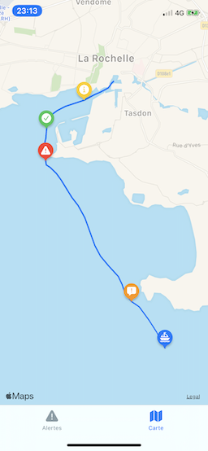

# Projet tutoré : Alertes météo

[](https://github.com/RemiBardon/L3I-AlertesMeteo/LICENSE)


## Description

### Cadre du projet

Dans le cadre de notre projet de deuxième année de DUT Informatique, nous avons travaillé, en équipe de 5, avec un chercheur du L3I -laboratoire de recherches de La Rochelle Université- afin de mettre en place une architecture permettant la collecte de données météorologiques et l'envoi d'alertes après le traitement de celles-ci.

### Architecture Firebase


### Explication de ce repository

Ce projet est l'application mobile développée pour iOS en Swift permettant à un utilisateur de s'inscrire à des alertes afin de recevoir des notifications. Il peut également consulter l'activité des capteurs concernés grâce à un affichage en temps réel des informations collectées.

### Illustrations de l'application

### Écran 'Alertes'


### Écran 'Abonnements'


### Abonnement à une nouvelle alerte


### Rafraîhissement des alertes


### Écran 'Carte'



## Récupérer le projet

### Prérequis

* XCode 11.0
* Swift 5.0
* Node Package Manager (npm)
* Firebase CLI (instructions d'installation plus bas)

### Installation

1. **Télécharger une copie du projet**

    Suivez ces instructions pour télécharger une copie de ce projet sur votre machine locale :

    * [Installer Git](https://git-scm.com/book/en/v2/Getting-Started-Installing-Git)
    * [Paramétrer Git](https://help.github.com/en/articles/set-up-git)
    * Cloner le projet

        ```bash
        cd <dossier>
        git clone https://github.com/RemiBardon/L3I-AlertesMeteo.git
        ```

2. **Configurer le projet Firebase**

    * [Créer un projet](https://firebase.google.com/docs/ios/setup#create-firebase-project) depuis la [Console Firebase](https://console.firebase.google.com/)
    * Créer la base de donnée Firestore en faisant : **Database > Create Database**
    * Choisir les règles de sécurité en mode test
    * [Installer](https://firebase.google.com/docs/cli#install_the_firebase_cli) (`npm -g i firebase-tools`) ou [mettre à jour](https://firebase.google.com/docs/cli#update-cli) Firebase CLI.

        > **Remarque :** Si vous rencontrez une erreur lors de l'exécution de `npm install` ou `npm -g i firebase-tools`, ne **faites pas** `sudo`, suivez les instructions de npm : [Resolving EACCES permissions errors when installing packages globally](https://docs.npmjs.com/resolving-eacces-permissions-errors-when-installing-packages-globally)
        >
        > 

    * Lier la CLI au projet créé précédemment

        ```bash
        firebase use --add
        ```

    * Déployer la configuration de Cloud Firestore et les Cloud Functions

        ```bash
        firebase deploy
        ```

3. **Déployer l'application iOS**

    * Installer XCode 11.0 ou supérieur depuis l'AppStore.
    * Installer les dépendances

        ```bash
        cd iOS-App
        pod install
        ```

    * Ouvrir [`iOS-App/AlertesMeteo.xcworkspace`](iOS-App/AlertesMeteo.xcworkspace)

        ```bash
        open "AlertesMeteo.xcworkspace"
        ```

    * Si besoin, configurer la signature de l'application
    
    * [Enregistrer l'application dans le projet Firebase](https://firebase.google.com/docs/ios/setup#register-app)
    * [Ajouter le fichier de configuration de Firebase](https://firebase.google.com/docs/ios/setup#add-config-file) au projet XCode (dans le dossier `SupportingFiles` de préférence)
    * Déployer sur un appareil ou simulateur possédant iOS 13.0 au minimum

## Dépendances

### Cocoapods


## Commandes utiles

### Firebase

#### Cloud Firestore

[Documentation Cloud Firestore](https://firebase.google.com/docs/firestore)

* Déployer les règles de sécurité

    ```bash
    firebase deploy --only firestore:rules
    ```

* Déployer les règles d'indexation

    ```bash
    firebase deploy --only firestore:indexes
    ```

#### Cloud Functions

[Documentation de Cloud Functions](https://firebase.google.com/docs/functions)

* Déployer toutes les fonctions

    ```bash
    firebase deploy --only functions
    ```

* Déployer une fonction

    ```bash
    firebase deploy --only functions:<nom_fonction>
    ```

* Déployer plusieurs fonctions

    ```bash
    firebase deploy --only functions:<nom_fonction>,functions:<nom_fonction>
    ```

## Auteurs

* [**Rémi Bardon**](https://github.com/RemiBardon) @RemiBardon - *Développement de l'application et du projet Firebase*

Voir aussi la liste des [contributeurs](https://github.com/RemiBardon/L3I-AlertesMeteo/graphs/contributors) qui ont participé à ce projet.

## Licence

Ce projet est protégé par la licence MIT - voir le fichier [LICENSE](LICENSE) pour plus de détails.
